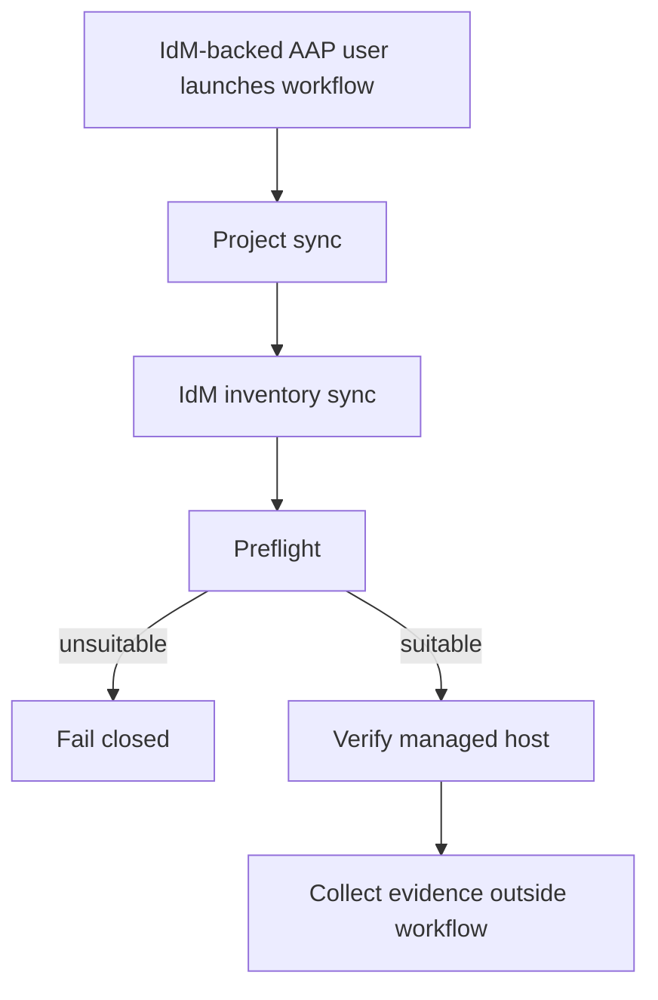

# Blastwall AAP Demo

This page describes the Controller-based Blastwall demo path. It is separate
from the Calabi Ansible-only proof path so the AAP workflow can be repeated,
reset, and recorded without disturbing the baseline lab exercise.

The published recording and breakdown live at `docs/aap-demo.html`.

## Demo Boundary

Use the Ansible-only path as the bootstrap and reference proof. Use the AAP demo
landing zone for the Controller workflow.

The AAP landing zone should have its own:

- managed-host target or target group
- IdM hostgroup and HBAC scope
- AAP inventory source path
- evidence collection path
- reset procedure

Do not use the same target state as the clean Ansible-only path for the recorded
AAP workflow. The AAP path should be able to show project sync, inventory sync,
preflight, verification, and evidence collection as a repeatable Controller
exercise.

## Controller Objects

The public Controller configuration lives in `aap/`.

The intended objects are:

- Organization: `Blastwall`
- Project: `Blastwall`
- Project URL: `https://github.com/gprocunier/blastwall.git`
- Project branch: `main`
- Execution Environment: `Blastwall EE`
- Inventory: `Blastwall IdM Inventory`
- Inventory source: `inventory/blastwall-idm.yml`
- Credential type: `Blastwall IdM Runtime`
- Machine credential: `svc-ansible-runner`
- Workflow template: `Blastwall policy rollout`

The IdM runtime credential injects:

- `IPA_SERVER`
- `IPA_DOMAIN`
- `IPA_REALM`
- `IPA_PRINCIPAL`
- `IPA_ADMIN_PASSWORD`
- `IPA_CERT`
- `KRB5_CONFIG`
- `BLASTWALL_IDENTITY`

Secrets are populated from the local lab environment at configuration time.
They are not committed to the repository. The preflight play writes a minimal
FreeIPA client config inside the execution environment before using
`ipalib`-backed lookups.

## Execution Environment

Build the execution environment from `execution-environment/`.

```bash
ansible-builder build \
  -f execution-environment/execution-environment.yml \
  --build-arg PKGMGR=/usr/bin/microdnf \
  --build-arg PYCMD=/usr/bin/python3.12 \
  -t blastwall-ee:0.5.0
```

For the Calabi recording path, publish the image to the lab mirror registry:

```text
mirror-registry.workshop.lan:8443/blastwall/blastwall-ee:0.5.0
mirror-registry.workshop.lan:8443/blastwall/blastwall-ee:latest
```

The mirror registry uses an IdM-issued certificate. The Calabi overlay verifies
registry readiness, push access, and AAP namespace pull access before Controller
configuration points AAP at the image.

## Calabi Overlay

The Calabi-specific AAP overlay lives under `poc-calabi/aap/` and runs from
`bastion-01`.

```bash
ansible-playbook poc-calabi/aap/00-aap-readiness.yml
ansible-playbook poc-calabi/aap/05-configure-ee-registry.yml
ansible-playbook poc-calabi/aap/10-build-and-push-ee.yml
ansible-playbook poc-calabi/aap/15-prepare-demo-user.yml
ansible-playbook poc-calabi/aap/20-configure-controller.yml
ansible-playbook poc-calabi/aap/30-launch-workflow.yml
ansible-playbook poc-calabi/aap/40-collect-evidence.yml
```

Admin credentials are for setup and troubleshooting. The workflow launch should
be exercised with an IdM-backed AAP user, such as `blastwall-demo`. Target
automation runs as `svc-ansible-runner`.

For recording and operator-facing demos, prefer the conventional `awx` CLI for
visible AAP interaction. Use the Calabi playbooks to prepare or reconcile
Controller objects, then show the high-value path manually with `awx`: Controller
health, object lists, workflow launch, workflow monitoring, node job status, and
targeted job stdout.

## Workflow

The Controller workflow is a current-host verification path. Policy
installation, package updates, and marker publication stay outside the confined
`blastwall_t` automation path. That is intentional: the self-protection policy
is supposed to prevent privileged confined automation from mutating SELinux
policy and package state.



Preflight is a Controller-side suitability gate. It runs in the Blastwall EE,
uses the synced IdM inventory groups as input, and fails closed when no host is
eligible for verification.

Policy installation and marker publication are bootstrap work. The recorded AAP
workflow starts after that handoff: preflight proves IdM, HBAC, sudo, and policy
markers are suitable, then verification obtains a Kerberos ticket for GSSAPI SSH
and proves the confined runtime behavior on current hosts.

## Candidate Markers

The IdM inventory source groups hosts with current policy markers into
`blastwall_policy_current` and unsuitable hosts into `blastwall_policy_stale`.

The marker set currently expected by preflight is:

```text
blastwall_policy_rpm=blastwall-selinux-0.5.0-1
blastwall_policy_state=active
blastwall_policy_alg_socket=denied
blastwall_policy_bpf=denied
blastwall_policy_selfprotect=denied
blastwall_policy_packet_socket=denied
blastwall_policy_userns=denied
blastwall_policy_io_uring=denied
```

Markers are selection hints, not proof. The workflow still verifies SELinux
context, sudo confinement, and runtime denial behavior on the managed host.

## Publication Notes

The generic AAP assets avoid Calabi-specific secrets and hostnames. Calabi
details stay under `poc-calabi/aap/`.

Before publishing a release or tag, re-run the sanitization pass and confirm
that any local recovery steps, rerun workarounds, or one-off lab migration
commands are not part of the documented fresh-deploy path.
