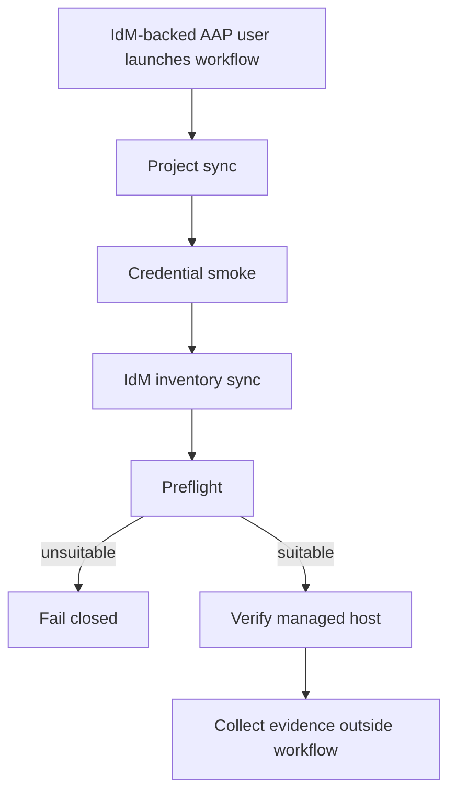

# Blastwall AAP Demo

This page describes the Controller-based Blastwall demo path. It is separate
from the Calabi Ansible-only proof path so the AAP workflow can be repeated,
reset, and recorded without disturbing the baseline lab exercise.

The published recording and breakdown live at
`https://gprocunier.github.io/blastwall/aap-demo.html`.

## Demo Boundary

Use the Ansible-only path as the bootstrap and reference proof. Use the AAP demo
landing zone for the Controller workflow.

The AAP landing zone should have its own:

- managed-host target or target group
- IdM hostgroup and HBAC scope
- AAP inventory source path
- evidence collection path
- reset procedure

Do not use the same target state as the clean Ansible-only path for the recorded
AAP workflow. The AAP path should be able to show project sync, runtime
credential smoke, inventory sync, preflight, verification, and evidence
collection as a repeatable Controller exercise.

## Controller Objects

The public Controller configuration lives in `aap/`.

The intended objects are:

- Organization: `Blastwall`
- Project: `Blastwall`
- Project URL: `https://github.com/gprocunier/blastwall.git`
- Project branch: `main` for the generic Controller assets. The Calabi RC gate
  overrides this with `BLASTWALL_PROJECT_BRANCH`, and the current Calabi overlay
  defaults that value to `blastwall-v2-phase-08-rc1k`.
- Execution Environment: `Blastwall EE`
- Inventory: `Blastwall IdM Inventory`
- Inventory source: `inventory/blastwall-idm.yml`
- Credential type: `Blastwall IdM Runtime`
- Machine credential: `svc-ansible-runner`
- Workflow template: `Blastwall runtime verification`

The IdM runtime credential injects:

- `IPA_SERVER`
- `IPA_DOMAIN`
- `IPA_REALM`
- `IPA_PRINCIPAL`
- `IPA_KEYTAB` for keytab-backed runs, or `IPA_PASSWORD` for the lab/demo fallback
- `IPA_ADMIN_PASSWORD` as a compatibility alias for the current IdM inventory plugin
- `IPA_CERT`
- `KRB5_CONFIG`
- `BLASTWALL_IDENTITY`

Secrets are populated from the local lab environment at configuration time.
They are not committed to the repository. For production-style runs, use a
least-privilege IdM service principal and a keytab-backed AAP credential. The
Calabi recording can still use the password fallback because it is a lab
demonstration. The preflight play writes a minimal FreeIPA client config inside
the execution environment before using `ipalib`-backed lookups.

## Execution Environment

Build the execution environment from `execution-environment/`.

```bash
ansible-builder build \
  -f execution-environment/execution-environment.yml \
  --build-arg PKGMGR=/usr/bin/microdnf \
  --build-arg PYCMD=/usr/bin/python3.12 \
  -t blastwall-ee:0.5.0
```

For the Calabi recording path, publish the image to the lab mirror registry:

```text
mirror-registry.workshop.lan:8443/blastwall/blastwall-ee:0.5.0
mirror-registry.workshop.lan:8443/blastwall/blastwall-ee:latest
```

The EE base image is pinned by digest in `execution-environment/`. The
additional `latest` tag above is a Calabi convenience tag for the lab mirror,
not the source image selector.

The mirror registry uses an IdM-issued certificate. The Calabi overlay verifies
registry readiness, push access, and AAP namespace pull access before Controller
configuration points AAP at the image.

## Calabi Overlay

The Calabi-specific AAP overlay lives under `poc-calabi/aap/` and runs from
`bastion-01`.

```bash
ansible-playbook poc-calabi/aap/00-aap-readiness.yml
ansible-playbook poc-calabi/aap/05-configure-ee-registry.yml
ansible-playbook poc-calabi/aap/10-build-and-push-ee.yml
ansible-playbook poc-calabi/aap/15-prepare-demo-user.yml
ansible-playbook poc-calabi/aap/20-configure-controller.yml
ansible-playbook poc-calabi/aap/25-seed-selection-fixture.yml
ansible-playbook poc-calabi/aap/30-launch-workflow.yml
ansible-playbook poc-calabi/aap/40-collect-evidence.yml
```

Admin credentials are for setup and troubleshooting. The workflow launch should
be exercised with an IdM-backed AAP user, such as `blastwall-demo`. Target
automation runs as `svc-ansible-runner`.

For recording and operator-facing demos, prefer the conventional `awx` CLI for
visible AAP interaction. Use the Calabi playbooks to prepare or reconcile
Controller objects, then show the high-value path manually with `awx`: Controller
health, object lists, workflow launch, workflow monitoring, node job status, and
targeted job stdout.

## Workflow

The Controller workflow is a current-host verification path. Policy
installation, package updates, and marker publication stay outside the confined
`blastwall_t` automation path. That is intentional: the self-protection policy
is supposed to prevent privileged confined automation from mutating SELinux
policy and package state.



Credential smoke is a Controller-side check that the injected `Blastwall IdM
Runtime` credential can authenticate and read the expected IdM state before the
inventory sync and preflight depend on it. The runtime verify preflight target is
profile-aware and defaults to `blastwall_profile_base` (resolved from
`BLASTWALL_AAP_VERIFY_TARGET_GROUP`) in the run workflow.

Use this rollout split:

- For stale host repair rollouts, set `BLASTWALL_POLICY_PIPELINE_CANDIDATE_GROUP`
  to `blastwall_policy_candidate`.
- For base/current verification, set `BLASTWALL_POLICY_PIPELINE_CANDIDATE_GROUP` to
  `blastwall_profile_base` (or an equivalent curated lab cohort), and keep
  `BLASTWALL_AAP_VERIFY_TARGET_GROUP=blastwall_profile_base`.
- For base-current to strange-socket dry-run rollout, set
  `BLASTWALL_POLICY_PIPELINE_CANDIDATE_GROUP` to a curated base-current lab
  cohort, leave `BLASTWALL_POST_PROMOTION_PREFLIGHT_TARGET_GROUP` unset so the
  post-promotion gate derives the required profile group, set
  `BLASTWALL_REQUIRED_POLICY_PROFILES=base,strange-socket-v1` and
  `BLASTWALL_ALLOW_DRY_RUN_PROFILES=true`, render/apply OpenShift/SPO with
  `BLASTWALL_SPO_INCLUDE_STRANGE_SOCKET_V1=true` and
  `BLASTWALL_SPO_VALIDATE_STRANGE_SOCKET_V1=true`, then verify after promotion
  with `BLASTWALL_AAP_VERIFY_TARGET_GROUP=blastwall_profile_strange_socket_v1`.

Preflight normally uses the synced IdM inventory profile groups and fails
closed when no host is eligible for verification. The policy-pipeline
post-promotion gate follows that profile-derived targeting by default and then
runs the parser-backed marker check with the workflow's required-profile
variables. Use `BLASTWALL_POST_PROMOTION_PREFLIGHT_TARGET_GROUP` only for an
explicit curated cohort that remains addressable after promotion.

Policy installation and marker publication are bootstrap work. The recorded AAP
workflow starts after that handoff: preflight proves IdM, HBAC, sudo, and policy
markers are suitable, then verification obtains a Kerberos ticket for GSSAPI SSH
and proves the confined runtime behavior on current hosts.

## Candidate Markers

The IdM inventory source groups hosts with current policy markers into
`blastwall_policy_current` and unsuitable hosts into `blastwall_policy_stale`.
The Calabi policy-pipeline candidate group is pinned to
`mirror-registry.workshop.lan`, so the AAP selection fixture now seeds that same
host by default when intentionally preparing a stale remediation run. If a
recording needs a separate rejected fixture for audience visibility, set
`BLASTWALL_STALE_HOST=stale-blastwall-01.workshop.lan` before running
`poc-calabi/aap/25-seed-selection-fixture.yml`. Runtime verification still
targets the profile-aware current group, not every policy-pipeline candidate.

Candidate RPM install/verify/promotion is controlled by a separate
`BLASTWALL_POLICY_PIPELINE_CANDIDATE_GROUP` host cohort, which keeps policy-pipeline
candidate execution and stale/candidate staging distinct from profile-aware runtime/preflight
selection.

The marker set currently expected by preflight is:

```text
bw_rpm=blastwall-selinux-0.5.2-1
bw_state=active
bw_alg=deny
bw_bpf=deny
bw_self=deny
bw_pkt=deny
bw_userns=deny
bw_iou=deny
bw_xfrm=deny
bw_rxrpc=deny
```

Markers are selection hints, not proof. The workflow still verifies SELinux
context, sudo confinement, and runtime denial behavior on the managed host.

## Publication Notes

The generic AAP assets avoid Calabi-specific secrets and hostnames. Calabi
details stay under `poc-calabi/aap/`.

Before publishing a release or tag, re-run the sanitization pass and confirm
that any local recovery steps, rerun workarounds, or one-off lab migration
commands are not part of the documented fresh-deploy path.
