# blastwall

`blastwall` is a proof of concept for using SELinux user confinement as an
exploit firewall for privileged automation.

This follows from the argument I made in
[`privileged-automation-security`](https://gprocunier.github.io/privileged-automation-security/):
I do not want automation to inherit the same assumptions as an unconfined human
operator and then move faster.  I want automation to start constrained.  I want
movement out of that constraint to be narrow, deliberate, and visible.

The first concrete target is the Copy Fail exploit path.  This project is
inspired by Anthony Green's
[`block-copyfail`](https://github.com/atgreen/block-copyfail) PoC.  Anthony's
project uses BPF LSM to block only `AF_ALG` binds for `authencesn`.  That is
the right shape when the mitigation needs kernel argument precision.

Blastwall asks a different question.  If the vulnerable path should be blocked
for privileged automation identities, can I make that part of the same
SELinux, IdM, AAP, and content-delivery model I already expect RHEL operators
to understand?  SELinux cannot inspect the `authencesn` algorithm string, so
this PoC blocks the broader surface for mapped automation sessions:
`blastwall_u` domains are denied `alg_socket` access entirely.

## Why This Matters Now

The rate at which new exploit surfaces are discovered is accelerating.
Agentic AI tools can now perform autonomous vulnerability research: code
auditing, fuzzing, binary analysis, and exploit chain construction.  These
tools are compressing the timeline between "vulnerability exists" and "exploit
is weaponized."  What once took dedicated research teams months can now surface
in days or hours.

This changes the risk calculus for automation.  Every automation identity that
runs unconfined is a standing invitation: when the next kernel 0-day drops, that
identity already has the access, the speed, and the reach to move laterally
across the entire fleet before a patch is even available.  Organizations that
adopt broad privileged automation without confinement are building a
superhighway.  High speed, high privilege, low friction, and an attacker only
needs one exploit to get on the road.

The question is not whether a new kernel vulnerability will appear.  It is
whether your automation identities are already constrained enough that the
vulnerability's blast radius is bounded before you even know the CVE number.
Blastwall is designed around that assumption: confine first, deny broad exploit
surfaces for automation by default, and make the confinement lifecycle fast
enough to add new deny scopes as threats emerge, faster than kernel patches
move through the fleet.

A formal threat model covering scope, trust boundaries, adversary capabilities,
and concrete attack paths is in [`THREAT-MODEL.md`](THREAT-MODEL.md).

## Calabi Demo

The GitHub Pages demo in [`docs/demo.html`](docs/demo.html) was recorded in
[`Calabi`](https://gprocunier.github.io/calabi/), my lab project for folding a
realistic disconnected OpenShift and support-services environment into a
controlled nested-KVM system. In Blastwall, Calabi is not a required platform.
It is the validation lab I used because it gives the proof a real IdM server,
bastion host, mirror registry, Kerberos flow, and managed endpoint instead of a
mock topology.

The demo shows the PoC from `bastion-01`: IdM creates and proves
`svc-ansible-runner`, `eigenstate.ipa` validates the read-side gate, direct
GSSAPI SSH probes land in `blastwall_u:blastwall_r:blastwall_t:s0`, the target
audit log shows denied AF_ALG, BPF, packet_socket, userns, and io_uring activity, and the
final self-protection step proves SELinux blocks a sudo-expanded `semodule`
breakout.

## The Argument

I do not think FreeIPA should author SELinux policy.  I think FreeIPA should
map named identities into SELinux users and roles that already exist on the
endpoint.  I also do not think AAP should discover halfway through a play that
the target host was not in the right confinement state.

The model has three parts:

1. Local policy on each managed RHEL host defines `blastwall_u`,
   `blastwall_r`, and the confined automation domain
   `blastwall_root_local_t`.
2. FreeIPA/IdM maps AAP automation identities into `blastwall_u` with an
   HBAC-linked SELinux user map.
3. AAP uses [`eigenstate.ipa`](https://gprocunier.github.io/eigenstate-ipa/)
   before running jobs to select eligible hosts and fail closed when SELinux
   map, HBAC, sudo, or optional host policy markers do
   not match expectations.

The point is not to replace kernel patches.  The point is to make privileged
automation land inside a narrow domain where known exploit surfaces can be
blocked quickly while the real fix is still moving through the fleet.

## Inspiration: block-copyfail

`block-copyfail` is the reference point for this work because it shows the
kernel-native shape of the mitigation:

- hook the relevant LSM decision point;
- inspect the syscall argument that contains the algorithm name;
- deny only the vulnerable `authencesn` AF_ALG bind;
- leave unrelated AF_ALG users alone.

That precision is the strength of BPF LSM.  Blastwall does not compete with it
on per-argument filtering.  It borrows the same practical lesson, which is that
the exploit should be stopped before it reaches the vulnerable kernel path, and
then moves the control boundary into the automation trust model.


## Why I Would Build This

I would build this because the logistics matter.

In a RHEL automation estate, a versioned SELinux policy RPM is often easier to
stage, promote, audit, and roll back than a new set of eBPF probes.  That does
not make SELinux more precise.  It makes the mitigation fit the machinery that
already exists around RHEL operations.

If the exploit can be mitigated by denying a broad surface for automation
identities, this is the kind of workflow I want:


That path is operationally ordinary:

- RPM versioning gives the mitigation a concrete artifact name.
- Satellite can stage, promote, pin, report, and roll back the package.
- AAP can install the package with normal `dnf` workflows.
- IdM can expose which identities and hosts are in scope.
- [`eigenstate.ipa`](https://gprocunier.github.io/eigenstate-ipa/) can make
  AAP aware of SELinux maps, HBAC access, sudo policy, and optional host
  coverage markers before a job starts.
- Audit and change control can reason about
  `blastwall-selinux-0.5.0-1` more easily than a dynamically attached probe.

The tradeoff is precision.  BPF LSM can inspect kernel hook arguments and block
one exact shape, such as `authencesn` in `socket_bind`.  Blastwall blocks
broader SELinux surfaces for a specific subject: privileged automation mapped
into `blastwall_u`.

That is often acceptable for automation.  Many AAP jobs do not need
`AF_ALG`, BPF, raw packet sockets, user namespace creation, or `io_uring`.  Blocking
those surfaces for automation identities is part of the point.

The short version:

```text
BPF LSM is the precision tool.
Blastwall is the identity, policy, and delivery model.
```

## What This Adds To AAP And IdM

The important question is not only "can this exploit be blocked?"  It is also:

- which automation identities are allowed to run on this host;
- whether those identities land in a confined SELinux user;
- whether sudo reaches root without escaping confinement;
- whether AAP can tell which hosts have the required mitigation before running;
- whether policy coverage can be versioned, rolled out, and audited through
  IdM-visible host state.

That is where the combination of
[`eigenstate.ipa`](https://gprocunier.github.io/eigenstate-ipa/), AAP, and IdM
matters.  IdM is the source of truth for identity, host scope, HBAC, sudo,
SELinux user mapping, and
optional host policy markers.  AAP consumes that truth before execution.
SELinux provides the host-local enforcement once the automation session lands.


The host is not merely patched or unpatched.  For a given job, it is suitable
or unsuitable based on current IdM state and local policy coverage.

## Coverage Expansion Model

Treat Blastwall as a small policy product, not a one-off rule.  If another
high-value exploit surface should be blocked for automation before the fleet is
patched, the workflow is:

1. Define the new exploit surface in terms SELinux can enforce.
2. Add a new policy scope to the Blastwall policy source.
3. Generate and review the updated policy module/RPM.
4. Bump the Blastwall policy version.
5. Roll out the policy to eligible hosts.
6. Update the IdM host marker with the new version and coverage claims.
7. Let AAP inventory and preflight prefer only hosts with the required coverage.

That keeps emergency mitigations from becoming untracked local state.  Each new
rule has a version, a stated scope, and an inventory-visible rollout state.

### Self-Protection Scope

Policy self-protection is now a base Blastwall scope.  It is not an
exploit-specific mitigation like `alg_socket` or `bpf` or `io_uring`.  It protects the wall
itself.

The current self-protection CIL denies `blastwall_t` from executing SELinux
policy-management entry points such as `semodule`, `semanage`, `setsebool`, and
`load_policy`, from using SELinux `security` class permissions such as
`load_policy`, `setenforce`, and `setbool`, and from writing the local SELinux
policy store under the common targeted-policy types.  I deliberately do not deny
process context setters like `setexec` or `setkeycreate`; sudo needs those to
honor the `role=blastwall_r` and `type=blastwall_t` options without falling back
to an unconfined context.

The Calabi validation playbook temporarily adds `/usr/sbin/semodule` to the
Blastwall sudo command group, proves the automation user can see that expanded
sudo surface, then attempts to remove a deny module.  The expected result is not
a sudo rejection.  The expected result is SELinux denying execution from
`blastwall_t` against `semanage_exec_t`, with the Blastwall modules still
installed afterwards.


## Architecture Flow


## Repository Layout

- `policy/` - SELinux reference-policy module and login context template.
- `idm/` - IdM object creation example for group, HBAC, sudo, and user map.
- `inventory/` - [`eigenstate.ipa.idm`](https://gprocunier.github.io/eigenstate-ipa/) inventory source for AAP.
- `playbooks/` - AAP/controller preflight, policy deployment, and host checks.
- `tests/` - safe AF_ALG, BPF, packet_socket, userns, and io_uring probes used to verify denial.
- `poc-calabi/` - Calabi lab exercise for replaying the proof path after
  watching the demo.

## IdM Relationship Model



## Requirements

Managed RHEL hosts need:

- SELinux enforcing.
- SELinux userspace 3.6 or newer for CIL `deny` rules.
- `selinux-policy-devel`
- `checkpolicy`
- `policycoreutils-python-utils`
- `make`

AAP execution environments that run the preflight need:

- [`eigenstate.ipa`](https://gprocunier.github.io/eigenstate-ipa/)
- `python3-ipalib`
- `python3-ipaclient`
- `krb5-workstation`
- a mounted IdM keytab and CA certificate

Install Ansible collection dependencies with:

```bash
ansible-galaxy collection install -r requirements.yml
```

## Quick Demo Flow

On each managed host, install the local SELinux policy and login context:

```bash
sudo make -C policy install
sudo install -D -m 0644 \
  policy/contexts/blastwall_u \
  /etc/selinux/targeted/contexts/users/blastwall_u
sudo semanage user -a -R blastwall_r -r s0 blastwall_u
```

If `blastwall_u` already exists, modify it instead:

```bash
sudo semanage user -m -R blastwall_r -r s0 blastwall_u
```

In IdM, create the automation group, managed-host group, HBAC rule, sudo rule,
and SELinux user map described by [`idm/bootstrap-blastwall.yml`](idm/bootstrap-blastwall.yml).
The Calabi lab exercise in [`poc-calabi/`](poc-calabi/) shows the full object
creation path with Ansible.

In AAP, sync inventory from:

```text
inventory/blastwall-idm.yml
```

Before any mutation job, run:

```text
playbooks/preflight.yml
```

Then run the managed-host verification:

```text
playbooks/verify-managed-host.yml
```

## Runtime Enforcement Flow


## Optional Host Suitability Markers

[`eigenstate.ipa.idm`](https://gprocunier.github.io/eigenstate-ipa/) can
export IdM host attributes into inventory hostvars.
This PoC uses `idm_description` as a simple marker carrier because it is already
available from normal host records.

The policy deployment play writes one marker per verified coverage claim:

```text
blastwall_policy_rpm=blastwall-selinux-0.5.0-1
blastwall_policy_state=active
blastwall_policy_alg_socket=denied
blastwall_policy_bpf=denied
blastwall_policy_selfprotect=denied
blastwall_policy_packet_socket=denied
blastwall_policy_userns=denied
blastwall_policy_io_uring=denied
```

When coverage expands, add markers only for surfaces that are actually enforced
and locally verified.  Avoid overloading a single boolean; AAP should be able to
ask for the exact policy version and deny scopes a job requires.

Inventory groups then split eligible hosts into:

- `blastwall_policy_current`
- `blastwall_policy_stale`

These markers are supplementary.  They help AAP choose the best candidates
when several hosts are HBAC-eligible.  They do not replace live SELinux, HBAC,
sudo, and runtime verification.


## Candidate Selection With Multiple Coverages

When two hosts are both reachable and mapped into `blastwall_u`, AAP should
prefer the host with the newest policy and the coverage required by the job.  A
job that only needs the Copy Fail mitigation can accept `alg_socket=denied`; a
job responding to a newer exploit can require both the older and newer markers.


The markers are not proof by themselves.  The rollout workflow should update
the marker only after local verification confirms the policy is installed and
the expected denial is observable.

## Type Alias Note

The reference-policy user template creates the concrete domain `blastwall_t`.
The policy also defines `blastwall_root_local_t` as a type alias so the public
PoC context names describe the root-local automation intent.  Some SELinux
tools canonicalize aliases back to `blastwall_t`; the verification play accepts
both names as long as the SELinux user and role remain `blastwall_u` and
`blastwall_r`.

## Important Limitation

SELinux can block broad object class access for a confined automation domain.
It cannot match kernel hook arguments such as `authencesn` inside
`struct sockaddr_alg`.  The current policy denies the demonstrated automation
surfaces: `alg_socket` for Copy Fail, `bpf`, `packet_socket`,
`userns_create`, and `io_uring`.  It also carries a self-protection scope that blocks
`blastwall_t` from running SELinux policy-management tools or writing the local
SELinux policy store.  If the requirement is argument-level precision while
preserving other uses of a blocked class, keep using an eBPF LSM mitigation like
Anthony Green's `block-copyfail`.


This PoC uses a CIL `deny` module because current distribution policy may grant
socket permissions through inherited user-domain attributes.  The deny rule
subtracts `alg_socket` access from `blastwall_t`; the paired `neverallow` keeps
future policy changes from silently restoring the permission.

The `io_uring` deny scope uses a CIL `optional` block so the module installs
cleanly on kernels that predate the `io_uring` object class.  When the class
is absent, the deny rule is silently skipped; when the class is present, the
deny and neverallow apply.  This is the convention for any future scope that
references a kernel object class not guaranteed to exist on all supported
RHEL versions.

## When To Choose Which

I would use `block-copyfail`-style BPF LSM when I need the narrowest runtime
mitigation and I want to preserve unrelated AF_ALG use.  It is shaped around
the vulnerable kernel argument, which is exactly why it is useful.

I would use Blastwall when the mitigation should be tied to automation identity,
host scope, and the way RHEL estates are actually operated.  The advantage is
not finer kernel inspection.  The advantage is that the same control plane
answers:

- who may automate this host;
- what SELinux user they receive;
- what sudo policy they inherit;
- what exploit surfaces the host policy claims to cover;
- whether AAP should run, skip, or remediate the host.

The two approaches compose well.  BPF LSM gives me precision at the kernel
hook.  Blastwall gives me an identity-scoped automation boundary and a rollout
record that AAP can use before it touches the host.
