# Blastwall Threat Model

I want to be explicit about what Blastwall defends, what it assumes, and
where it can be attacked.  If I am going to argue that automation should
start constrained, I should also say where the constraints stop working.

## 1. Purpose and Scope

### What I Am Trying To Protect

Blastwall confines privileged automation identities on managed RHEL hosts.
It maps them into a restricted SELinux user (`blastwall_u`) that denies
access to known exploit surfaces.  The confinement lifecycle (policy
authoring, RPM packaging, deployment, verification, IdM marker, AAP
preflight) is built to ship exploit surface denials faster than kernel
patches move through the fleet.

That is the scope.  I am not trying to solve all of host security.  I am
trying to make sure that when my automation lands on a managed host, the
session starts inside a boundary that blocks known-dangerous surfaces.

### What I Am Not Trying To Protect

- **Human operator sessions.**  Blastwall applies only to automation
  identities mapped into `blastwall_u` via IdM SELinux user maps.  If you
  log in as yourself, you are not affected.
- **Container or VM workloads.**  The confinement operates at the SSH login
  layer via `pam_selinux`.  It has nothing to say about container runtimes,
  pod security, or hypervisor-level isolation.
- **Non-RHEL systems.**  The model depends on SELinux targeted policy,
  IdM/FreeIPA, and SSSD.  It is not portable.
- **AAP controller infrastructure.**  The controller is a trusted component.
  Securing it is a separate problem.
- **IdM/FreeIPA infrastructure.**  IdM is the policy system of record.  If
  IdM is compromised, Blastwall cannot help.

### Relationship to Other Mitigations

Blastwall does not replace kernel patches or BPF LSM mitigations like
`block-copyfail`.  Kernel patches fix the vulnerability.  BPF LSM blocks
the exact exploit argument.  Blastwall reduces the blast radius for
automation identities while those other mitigations are still moving through
the fleet.

I think of them as three layers, not three alternatives.

## 2. Threat Landscape

I made the high-level argument in
[Why This Matters Now](README.md#why-this-matters-now): AI-accelerated
vulnerability research is compressing the timeline between discovery and
weaponization, and unconfined automation is the blast radius amplifier.
Here I want to break down why that matters structurally.

### Why I Treat Automation As A Harder Problem Than Operator Compromise

When an operator gets compromised, the blast radius is bounded by what that
one person was doing at the time.  One session, one host, one set of open
connections.  It is bad, but it is containable.

The reason I treat automation differently is that it breaks all three of
those bounds at once:

1. **Reach.**  A single automation identity typically has HBAC access to
   tens, hundreds, or thousands of hosts.  Compromising that identity does
   not give the attacker one target.  It gives them a target list.
2. **Speed.**  Automation moves at machine speed with no human
   decision-making in the loop.  An attacker who can inject into that
   execution path inherits the same speed.
3. **Privilege assumption.**  Automation identities are often configured
   with broad sudo access because the alternative is per-task privilege
   scoping, which most teams never finish.  The practical result is that
   automation lands as root with few constraints.

Those three properties together are what turn a single kernel exploit into
fleet-wide lateral movement.  That is the failure mode I built Blastwall to
prevent.

### Why The Patch Cycle Is Not Fast Enough

The reason I do not rely on patching alone is timing.  A kernel
vulnerability goes through discovery, disclosure, patch development,
distribution packaging, staged rollout, and production deployment.  In most
enterprises that takes weeks to months.

During that entire window, every unconfined automation identity on every
unpatched host is exposed.  The exploit surface is live, the automation has
access, and the only thing between the attacker and lateral movement is
whether they have found the vulnerability yet.

AI-accelerated vulnerability research changes that side of the equation.
The volume of discoverable kernel exploit surfaces will increase faster than
patch cycles can absorb them.  I built Blastwall around the assumption that
confinement must be in place before the CVE number is assigned, not after.
If I wait for the patch, I am defending a window that is already open.

### What This Means For Confinement

So I cannot be reactive.  I cannot wait for a specific CVE and then build a
specific deny rule.  I need automation identities to start inside a boundary
that blocks broad classes of dangerous surfaces by default, and I need the
lifecycle to add new deny scopes faster than kernel patches move through the
fleet.

That is the design constraint behind Blastwall's architecture: versioned
policy RPMs, IdM-visible coverage markers, and AAP preflight gates that
fail closed when the required coverage is not present.

## 3. Adversary Model

### Who I Am Defending Against

A remote attacker who has obtained or developed a weaponized kernel exploit
targeting a surface reachable from automation sessions.  The attacker's goal
is lateral movement: use the automation identity's access, speed, and host
reach to compromise the fleet.

### What I Assume The Attacker Can Do

- Discover and weaponize kernel vulnerabilities, potentially using
  AI-accelerated research tools
- Reach hosts that automation identities have access to (directly or through
  an initial foothold)
- Chain exploits if the initial surface (e.g., AF_ALG socket creation) is
  available from the automation session
- Observe public information about the target's automation architecture

### What I Do Not Assume

- Compromise of IdM/FreeIPA (trusted infrastructure)
- Compromise of the AAP controller (trusted infrastructure)
- Compromise of kernel integrity on the managed host (SELinux enforcement
  depends on a non-compromised kernel)
- Physical access to managed hosts
- Supply chain compromise of the RPM build or delivery pipeline

If any of these are violated, the attacker is operating outside the
boundaries I designed Blastwall to defend.  Each represents a separate
security domain with its own controls.

## 4. Trust Boundaries

### Boundary Descriptions

1. **AAP controller.**  Trusted.  Runs preflight validation on `localhost`
   before dispatching jobs.  If the controller is compromised, the attacker
   can bypass preflight, but SELinux enforcement on managed hosts is
   independent and remains intact.

2. **IdM/FreeIPA.**  Trusted.  Authoritative source for identity mapping,
   HBAC rules, SELinux user maps, and sudo policy.  Blastwall reads this
   state; it does not independently verify it.

3. **Network transport.**  SSH with Kerberos authentication.  The trust
   boundary is at the managed host's `pam_selinux` resolution, not at the
   network layer.

4. **Managed host kernel.**  Trusted.  SELinux enforcement is a kernel
   function.  If the kernel is compromised, the attacker can disable or
   bypass SELinux policy.  That is the fundamental assumption that bounds
   all SELinux-based confinement.

5. **Automation session.**  Untrusted.  This is the subject I am confining.
   The session runs as `blastwall_u:blastwall_r:blastwall_t` with deny rules
   stripping access to specified exploit surfaces.

## 5. Assumptions

Every one of these must hold for the confinement to work.  If any assumption
is violated, the corresponding attack path in Section 6 becomes viable.

| # | Assumption | If Violated |
|---|---|---|
| A-1 | SELinux is in enforcing mode on managed hosts | Policy becomes audit-only; no enforcement (see AP-1) |
| A-2 | The managed host kernel is not compromised | Attacker can disable SELinux entirely (see AP-1) |
| A-3 | IdM/FreeIPA is authoritative and secured independently | Attacker can modify identity mappings, HBAC, sudo (see AP-3, AP-5) |
| A-4 | SSSD correctly applies SELinux user maps at login | Automation session may land in wrong SELinux context (see AP-4) |
| A-5 | RPM delivery chain has integrity | Attacker can ship a policy that removes deny rules |
| A-6 | Sudo rules are reviewed before expansion | Confinement erodes through operational convenience (see AP-2) |
| A-7 | AAP controller is secured independently | Attacker can bypass preflight and SSH directly (see AP-5) |

## 6. Attack Paths

### AP-1: Kernel Privilege Escalation

An attacker with code execution inside `blastwall_t` exploits a kernel
vulnerability to escape SELinux confinement entirely.

**Preconditions.**  A kernel privilege escalation vulnerability exists and is
reachable from the confined domain.

**Impact.**  Complete bypass of all Blastwall controls.  The attacker gains
unconfined access to the managed host.

**Current mitigation.**  None within Blastwall.  This is a fundamental
limitation shared by all SELinux-based confinement.  Kernel patching and
defense-in-depth (seccomp, BPF LSM, hardware isolation) are the appropriate
mitigations.

**Residual risk.**  Accepted.  If the attacker already has a kernel escape,
my assumptions are violated and I am in a different fight.

---

### AP-2: Sudo Expansion Granting Policy Modification

An automation team expands the sudo command allowlist to include `semodule`,
`semanage`, or write access to `/etc/selinux/`.  The `blastwall_t` domain
can then modify or remove its own confinement policy.

This is the attack path I worry about most.  Not because it requires a
sophisticated attacker, but because it happens through ordinary operational
pressure.  Someone needs broader sudo access for a legitimate task, the
allowlist grows, and one day it includes `semodule`.

**Preconditions.**  The sudo rule for the automation identity is expanded
without security review of the SELinux implications.

**Impact.**  The automation identity can remove deny rules, disabling
enforcement for its own session.

**Current mitigation.**  The preflight playbook (`playbooks/preflight.yml`)
audits the sudo rule for `unconfined_r` and `unconfined_t` leakage.  The
PoC sudo allowlist is deliberately narrow (`/usr/bin/id`).  The `0.3.0`
policy adds `blastwall-policy-selfprotect`, which denies `blastwall_t` from
executing common SELinux policy-management entry points, using SELinux
`security` class policy-changing permissions, using MAC override/admin
capabilities, or writing the local SELinux policy store.

**Residual risk.**  Moderate.  The self-protection policy now catches the
most direct host-local failure mode even if sudo grows to include `semodule`.
The remaining risk is indirect: an allowed command that can install packages,
write through another trusted domain, change IdM state, or otherwise avoid the
`blastwall_t` subject still needs review.

**What I want to build next.**  Preflight checks that report policy-management
commands in the sudo command group even though SELinux now blocks the direct
`blastwall_t` path.  Tooling or documentation still needs to help operators
evaluate whether a proposed sudo expansion breaks the confinement guarantee
through an indirect route.

---

### AP-3: IdM Host Marker Spoofing

An attacker (or misconfigured automation) writes a false
`blastwall_policy_state=active` marker to a host's IdM description.  The
preflight gate selects that host as a valid candidate even though no policy
is installed.

**Preconditions.**  The attacker has `ipa host-mod` access, either directly
or through the automation identity's sudo/HBAC grants.

**Impact.**  Jobs run on hosts that lack confinement policy.  The automation
session lands in an unconfined or partially confined state.

**Current mitigation.**  The managed-host verification playbook
(`playbooks/verify-managed-host.yml`) checks the actual SELinux context and
runs the AF_ALG, BPF, packet_socket, and userns probes after deployment.  But
that is a point-in-time check, not continuous verification.

**Residual risk.**  Moderate.  The string-based marker has no cryptographic
binding to the actual policy state on the host.  An attacker who can write
the marker can deceive the preflight gate.  The verification playbook
catches this if it runs, but nothing guarantees it runs before every job.

**What I want to build next.**  A cryptographically signed attestation of
policy state, or at minimum, making the verification playbook a mandatory
preflight step rather than a separate workflow.

---

### AP-4: SSSD Cache Race

Between SSSD cache invalidation and the next login, there is a window where
the SELinux user map may not be applied.  A login during this window may
result in an unconfined session.

**Preconditions.**  SSSD cache was recently cleared (e.g., during policy
deployment).  The automation identity logs in before the cache is populated
with the correct SELinux user map.

**Impact.**  The automation session lands in `unconfined_u` instead of
`blastwall_u`.  All deny rules are bypassed.

**Current mitigation.**  The deployment playbook
(`poc-calabi/30-deploy-and-test.yml`) clears the SSSD cache and restarts
SSSD during deployment.  The verification step confirms the correct context
after login.

**Residual risk.**  Low.  The race window is small (typically seconds) and
requires the attacker to trigger a login at exactly the right moment.  The
deployment workflow's own verification step catches incorrect context
assignment.

---

### AP-5: AAP Controller Compromise

An attacker compromises the AAP controller and bypasses the preflight
playbook entirely, SSHing directly to managed hosts.

**Preconditions.**  The AAP controller is compromised.

**Impact.**  Preflight gates are bypassed.  However, SELinux enforcement on
managed hosts is independent of the controller.  If the automation identity
is correctly mapped in IdM, the session still lands in `blastwall_t` with
deny rules intact.

**Current mitigation.**  SELinux enforcement is host-local and does not
depend on the controller.  The preflight gate adds operational safety
(selecting suitable hosts, verifying policy state) but the kernel-level
enforcement stands on its own.

**Residual risk.**  Moderate.  The attacker loses the preflight safety net
but the core confinement remains.  The primary risk is that the attacker
targets hosts where policy is not installed (stale hosts) since the
preflight would have filtered those out.

---

### AP-6: Uncovered Exploit Surfaces

The attacker targets a kernel exploit surface that is not denied by the
current Blastwall policy.  The current policy denies `alg_socket`
(Copy Fail / AF_ALG), `bpf` (CVE-2026-31525, CVE-2026-31429,
CVE-2025-38154), `packet_socket` (CVE-2025-38617, CVE-2026-31504), and
`userns_create` (an exploit chain enabler; 44% of kernel exploits require user
namespaces).  It also protects the Blastwall policy-management surface from
direct modification by `blastwall_t`.

**Preconditions.**  A weaponized exploit exists for a surface not covered by
the deny rules.  The `blastwall_t` domain has access to that surface.

**Impact.**  The attacker exploits the vulnerability from within the
confined session.  The confinement provides no protection for uncovered
surfaces.

**Current mitigation.**  The demonstrated automation deny scope blocks
`alg_socket`, `bpf`, `packet_socket`, and `userns_create`.  The
self-protection scope denies direct policy manipulation.

**Residual risk.**  Moderate.  The current scope blocks the surfaces that
have strong exploit value and low expected value for privileged automation.
Other kernel surfaces remain candidates only when the exploit signal and
automation tradeoff justify adding them to the policy lifecycle.

**What I want to build next.**  A repeatable coverage-selection review for
new deny scopes, so additions are based on exploit value, automation impact,
and local verification quality rather than a growing list of low-value targets.

---

### AP-7: Policy Conflicts With Existing SELinux Modules

The Blastwall policy module conflicts with existing targeted policy,
third-party modules, or customer-specific SELinux customizations.  The
conflict causes unexpected denials of legitimate operations or unexpected
grants due to interaction effects.

**Preconditions.**  The managed host has SELinux policy modules that interact
with the permissions or types used by Blastwall.

**Impact.**  Ranges from broken automation (false denials) to weakened
confinement (unintended grants).

**Current mitigation.**  I kept the policy surface deliberately minimal.
The `userdom_admin_user_template` macro is standard reference-policy.  The
CIL deny + neverallow pair is narrow.  The `neverallow` prevents future
policy from silently re-granting denied permissions.

**Residual risk.**  Low for the current focused policy.  Increases as
coverage expands.  I do not have conflict detection or impact assessment
tooling yet.

**What I want to build next.**  Before adding new deny scopes, I need to
test the expanded policy against the default RHEL targeted policy and common
third-party modules, and document known interactions.

## 7. Mitigations Summary

| Attack Path | Status | Notes |
|---|---|---|
| AP-1: Kernel privilege escalation | Accepted risk | Fundamental SELinux limitation; out of scope |
| AP-2: Sudo expansion | Partially mitigated | Direct semodule-style policy manipulation is blocked by self-protection; indirect sudo escape still needs review |
| AP-3: Host marker spoofing | Partially mitigated | Verification playbook catches it post-deployment; no cryptographic binding |
| AP-4: SSSD cache race | Mitigated | Small window, caught by verification step |
| AP-5: Controller compromise | Partially mitigated | Host-local enforcement is independent; stale host selection is the residual risk |
| AP-6: Uncovered surfaces | Partially mitigated | AF_ALG, BPF, packet_socket, userns covered; policy self-protection added; future scopes require coverage-selection review |
| AP-7: Policy conflicts | Low risk | Minimal policy surface; neverallow guards against re-grants |

## 8. Future Work

- **Coverage selection review.**  Define the exploit-signal, automation-impact,
  and verification criteria a new deny surface must satisfy before it becomes a
  Blastwall policy scope.

- **Cryptographic policy attestation.**  Replace string-based IdM host
  markers with a signed statement of policy version and enforcement state.
  This binds the inventory claim to the actual host configuration.

- **Sudo expansion impact analysis.**  Tooling or preflight checks that
  evaluate whether a proposed sudo rule change grants access to indirect
  confinement-breaking capabilities.  Direct `semodule`-style policy
  manipulation is now blocked locally, but sudo still deserves first-class
  review.

- **Continuous confinement verification.**  Extend the verification model
  from point-in-time playbook checks to periodic or event-driven
  re-validation of host confinement state.

- **Multi-host scaling validation.**  Demonstrate the preflight and
  deployment lifecycle against an inventory of 10+ hosts with mixed policy
  coverage states.
