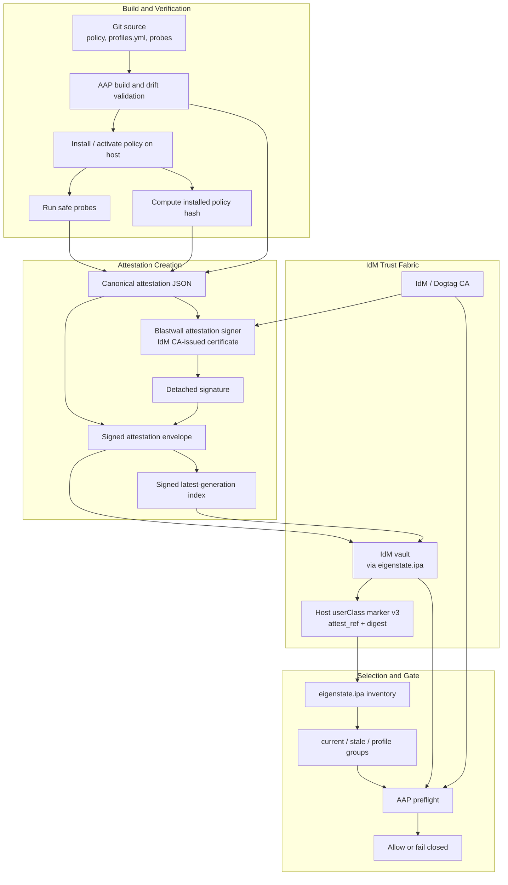
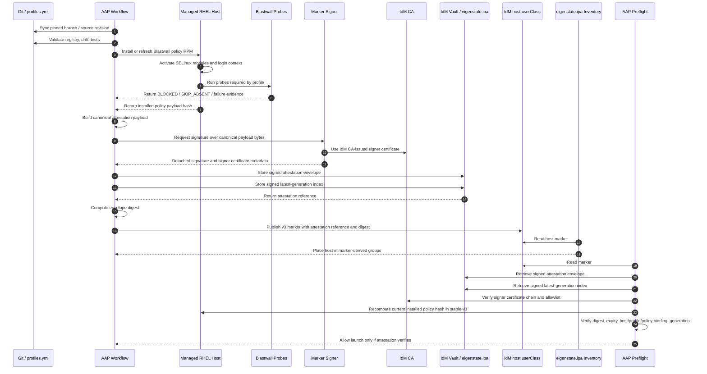
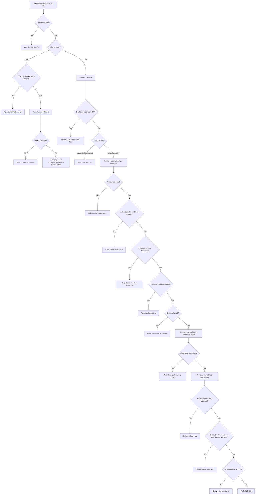

# Blastwall v3 Signed Attestation Design

**Document status:** Revised draft for external technical review  
**Revision:** Rev 3, incorporating KRA topology and IdM vault replication review feedback  
**Prepared for:** Blastwall v2 / v3 release and governance review  
**Date:** 2026-05-16  
**Primary design goal:** Replace marker-only host trust with signed, IdM-delivered attestation evidence while preserving the existing Blastwall control chain and making IdM vault/KRA topology an explicit trust dependency.

---

## 1. Executive Summary

Blastwall v2 uses IdM host markers as structured evidence claims. A marker can say that a host is current for a profile, contains a registry hash, and contains a policy hash. That is a useful operational contract, but it is **not cryptographic attestation**. A principal with marker-writing authority can still create a convincing marker string unless the claim is independently verified.

This document defines **Blastwall v3 signed attestations**.

The core change is:

```text
v2 marker:
  The marker itself is the host evidence claim.

v3 marker:
  The marker is a locator for a signed attestation artifact.
  Inventory may use the marker for host selection.
  Preflight must retrieve and verify the signed attestation before trusting the claim.
```

The signed artifact is created only after the controlled Blastwall workflow verifies the host, records probe evidence, computes the installed policy hash, and binds that evidence to the host, profile, registry hash, workflow identity, and validity window. The artifact is signed by a dedicated Blastwall attestation signer whose certificate chains to the IdM / Dogtag CA. The signed envelope is stored in an IdM vault and retrieved through `eigenstate.ipa` during preflight and audit.

This design does **not** make Blastwall independent of IdM or AAP. IdM and AAP remain trusted infrastructure. This design narrows a specific gap: **a marker can no longer be trusted merely because it is present in IdM; it must point to signed evidence that still matches the host at verification time.**

For `stable-v3`, this design makes the following controls mandatory:

- live installed-policy hash verification during preflight;
- signed latest-generation index verification to prevent replay;
- one signature format: internal detached signature over RFC 8785 / JCS canonical payload bytes;
- explicit revocation workflow;
- explicit vault access-control matrix;
- configured KRA-enabled IdM vault servers for all attestation read/write paths;
- same-replica vault affinity by default, with write-then-read verification before marker publication;
- KRA-aware health checks, canary artifacts, retry rules, and failure states;
- fail-closed behavior when marker, artifact, signer, index, host state, or KRA vault path disagree.

---

## 2. Background and Problem Statement

The Blastwall v2 proposal defines the evidence chain as:

```text
policy contains scopes
→ safe probes pass
→ marker is published
→ inventory groups the host
→ AAP preflight gates launch
→ workflow evidence is captured
```

The adversarial review concluded that Blastwall is technically substantive but identified the lack of cryptographic marker binding as a major maturity gap. The pre-mortem described a related operational failure mode: markers, inventory, probes, and host state can drift apart, and operators may lose trust when different parts of the control plane disagree.

The goal of v3 is to strengthen marker trust without replacing the existing IdM / AAP / SELinux model.

### 2.1 Current v2 marker limitation

A v2 marker contains structured fields such as:

```text
blastwall:v=2;
state=active;
target=rhel-login;
rpm=blastwall-selinux-0.6.1-0.rc1;
registry_sha256=<hash>;
policy_sha256=<hash>;
profiles=base;
scopes=...
```

This improves over unstructured host metadata, but it remains a string claim. It can be parsed, checked, and compared, but the marker itself is not signed. If a principal can write host `userClass`, it may be able to place a marker-like value there. Preflight and probes mitigate this, but the marker is not cryptographically bound to the verification event.

### 2.2 v3 design objective

Create a v3 model where a host marker is useful for inventory selection but not authoritative by itself.

The authoritative claim becomes:

```text
A signed attestation artifact that binds:
  host identity
  target runtime path
  profile set
  scope set
  registry hash
  installed policy hash
  probe evidence hash
  AAP workflow identity
  signer identity
  validity window
  latest generation
```

---

## 3. Branch and Release Strategy

### 3.1 Recommendation

Because Blastwall v2 is not yet published as stable, there are two possible implementation strategies:

1. refactor the current v2 feature branch directly; or
2. create a new v3 feature branch based on the latest remediated v2 branch.

The recommended strategy is:

```text
Create a new feature branch from the latest remediated v2 branch:
  blastwall-v3-signed-attestation

or, if preserving phase naming:
  blastwall-v2-phase-09-v3-attestation
```

### 3.2 Rationale

Although v2 is unpublished, v3 is not a small patch. It changes the trust model and introduces new moving parts:

- marker v3 grammar;
- signed attestation envelope;
- IdM vault artifact custody;
- signer identity and certificate lifecycle;
- latest-generation index;
- revocation state;
- live host policy-hash verification at preflight;
- audit and health checks;
- stable-v3 / transition / breakglass modes.

This should not be hidden inside the v2 remediation branch. The v2 branch should remain a clear control-plane and unsigned-marker evidence artifact. The v3 branch should be a trust-hardening branch that can be reviewed independently.

### 3.3 Release posture

Use this posture:

```text
v2 / rc1m:
  RC evidence artifact and transition/reference model.
  Not stable publication.

v3 signed attestation branch:
  New feature branch for high-assurance marker integrity.

stable claim:
  Either requires v3 signed attestation, or requires an explicit governance decision
  accepting unsigned v2 marker risk.
```

Do not publish v2 as stable and then immediately change marker trust semantics. Since v2 is unpublished, the cleanest path is to preserve v2 as the transition/reference lane and make v3 the stable-readiness target.

---

## 4. Design Principles

1. **Inventory selects; preflight verifies.** Inventory may use marker hints to group hosts. It must not be the final trust decision.
2. **The marker is a locator, not the proof.** The v3 marker points to signed evidence and carries digest metadata to detect tampering.
3. **Use existing domain trust.** IdM / FreeIPA, Kerberos, Dogtag CA, AAP credential injection, and `eigenstate.ipa` vault operations are the trust fabric.
4. **Separate custody from cryptographic proof.** IdM vault storage provides controlled custody and delivery. The signature provides integrity and signer authenticity.
5. **Fail closed on disagreement.** If marker, attestation, host state, profile registry, latest-generation index, or policy hash disagree, preflight rejects the host.
6. **Short-lived evidence.** Signed attestations have a validity window and must be refreshed. They are not permanent host certificates.
7. **Stable-v3 requires live drift checks.** For stable-v3, preflight must verify the current installed policy hash on the host.
8. **Stable-v3 requires replay protection.** For stable-v3, preflight must verify the signed latest-generation index for the host/profile set.
9. **Use one signature format.** v3 uses an internal detached signature over canonical JSON payload bytes. JWS is deferred until there is a concrete interoperability requirement.
10. **No new SELinux enforcement scope in this phase.** This design changes evidence trust, not deny posture.
11. **Keep v2 compatibility only as transition/reference behavior.** v2 markers may remain valid for RC or migration workflows, but v3 is the target for high-assurance stable claims.
12. **Treat KRA as part of the trust path.** IdM LDAP markers and IdM vault/KRA artifacts have different availability and consistency behavior; stable-v3 must target known KRA-enabled replicas explicitly.

---

## 5. Trust Assumptions and Boundaries

This design assumes:

- IdM / FreeIPA is trusted infrastructure.
- AAP is trusted workflow infrastructure.
- The IdM CA trust root is trusted by Blastwall verification workflows.
- SELinux is enforcing on managed hosts.
- SSSD / PAM correctly maps the automation principal into the expected SELinux context.
- The signer credential is held only by the controlled Blastwall signer workflow or signer service.
- Vault write authority and marker write authority are separated where possible.
- The host remains reachable for preflight verification when live state must be checked.
- IdM vault operations used for attestations target configured KRA-enabled replicas.
- The LDAP marker plane and the KRA-backed vault artifact plane are operationally distinct.

This design does **not** protect against:

- full IdM compromise;
- full AAP controller compromise;
- compromise of the Blastwall signing key;
- malicious policy build plus authorized signing;
- SELinux disabled on the host;
- kernel compromise that disables MAC enforcement;
- sudo expansion that routes around the intended boundary.

Those are existing trust-boundary and governance risks. This document addresses cryptographic marker integrity, drift detection, and KRA-aware artifact delivery, not full remote attestation of the platform.

### 5.1 Signer co-location with AAP

The initial implementation may colocate the signing workflow with AAP. This is an explicit tradeoff:

```text
Benefit:
  operational simplicity, reuse of AAP credentials, workflow evidence, and approval controls.

Risk:
  a full AAP compromise can produce false workflow evidence and can access the signer credential.
```

Therefore, v3 signed attestation protects against principals that can influence or write IdM marker text but **cannot** access the Blastwall signer. It does not add defense-in-depth against a fully compromised AAP controller when the signer is colocated with AAP.

For high-assurance deployments, evaluate one of the following:

- HSM-backed signer key;
- PKCS#11-backed signer operation;
- Dogtag/KRA-backed signing workflow;
- out-of-band signing service with explicit approval policy;
- signer process confined by SELinux and isolated from ordinary AAP job execution.

For lab and RC work, software keys may be acceptable if the signer key is restricted to a dedicated signer job, protected by strict filesystem ACLs, credential isolation, `no_log`, and SELinux confinement of the signer process.

---

## 6. Proposed Architecture

### 6.1 High-level flow



### 6.2 Sequence flow



### 6.3 LDAP marker plane versus KRA artifact plane

Stable-v3 separates two IdM-backed planes that have different behavior:

```text
LDAP marker plane:
  host userClass marker, inventory selection, profile grouping
  replicated through normal IdM / 389 Directory Server LDAP replication

KRA vault artifact plane:
  signed attestation envelope and signed latest-generation index
  stored and retrieved through IdM vault / Dogtag KRA
  available only on, or proxied through, KRA-enabled IdM replicas
```

A healthy IdM LDAP path does not prove the KRA vault path is healthy. Inventory may see a v3 marker while preflight is unable to retrieve the referenced attestation artifact. Therefore, stable-v3 treats KRA availability, KRA replica selection, and vault read/write consistency as part of the attestation trust path.

Default stable-v3 topology:

```text
configured primary KRA replica:
  signer writes attestation envelope and latest index
  signer reads both artifacts back before marker publication
  preflight reads both artifacts from the same replica
```

This same-replica affinity avoids false failures caused by KRA replication lag immediately after marker publication. Multi-KRA failover may be added later, but only with explicit retry semantics and clear failure-state reporting.

---

## 7. Marker v3 Grammar

A v3 marker is stored in IdM host `userClass`, but its purpose changes. It is a locator and selection hint.

### 7.1 Example

```text
blastwall:v=3;
state=active;
target=rhel-login;
rpm=blastwall-selinux-0.6.1-0.rc1;
profiles=base;
attest_ref=shared/blastwall-attestations/mirror-registry.workshop.lan/2026-05-16T143210Z-12345.json;
attest_sha256=9a4c2e...;
signer_kid=4c2a9f...;
generation=42;
exp=2026-05-17T14:32:10Z
```

Line breaks are shown for readability. The actual marker is a semicolon-delimited string.

### 7.2 Required fields

| Field | Meaning |
|---|---|
| `v=3` | Marker grammar version. |
| `state` | `active`, `lab-active`, `revoked`, `failed`, or `rollback-failed`. Only `active` and explicitly allowed `lab-active` can satisfy suitability. |
| `target` | Runtime target, for example `rhel-login`. |
| `rpm` | Expected installed Blastwall RPM NEVRA. |
| `profiles` | Canonical profile list, for example `base` or `base,strange-socket-v1`. |
| `attest_ref` | IdM vault reference for the signed attestation envelope. |
| `attest_sha256` | SHA-256 of the signed envelope bytes. |
| `signer_kid` | Signer key identifier. See section 7.4. |
| `generation` | Monotonic attestation generation for host/profile set. |
| `exp` | Marker-level expiry hint in UTC ISO-8601. Preflight must also verify the signed payload validity window. |

### 7.3 Reserved field handling

Reserved v3 fields are:

```text
v
state
target
rpm
profiles
attest_ref
attest_sha256
signer_kid
generation
exp
```

Rules:

- duplicate reserved fields are invalid;
- unknown non-reserved fields may be tolerated for forward compatibility;
- unknown non-reserved fields must not influence suitability;
- marker parser and inventory grouping must agree on suitability-sensitive fields;
- parser must reject duplicate reserved fields before interpretation.

### 7.4 `signer_kid` format

`signer_kid` is the lowercase hexadecimal Subject Key Identifier (SKI) extension value of the signer certificate, with no colons.

Example:

```text
signer_kid=4c2a9f12ab34cd56ef7890ab1234567890abcdef
```

If the signer certificate lacks an SKI extension, v3 signing is invalid. Do not fall back to subject name alone. The signer subject name may be logged and validated, but `signer_kid` is the stable key identifier.

### 7.5 Revoked state

`state=revoked` is a recognized non-suitable state.

Rules:

- parser must recognize it;
- inventory may classify it as stale or revoked;
- preflight must reject it;
- audit must report it distinctly from malformed marker states.

---

## 8. Signed Attestation Envelope

### 8.1 Envelope overview

The envelope is stored as JSON in an IdM vault.

```json
{
  "envelope_version": 1,
  "algorithm": "RSASSA-PSS-SHA256",
  "canonicalization": "RFC8785-JCS",
  "payload": { "...": "..." },
  "payload_sha256": "...",
  "signature": "base64...",
  "signer": {
    "ski": "4c2a9f...",
    "subject": "CN=blastwall-marker-signer/...",
    "issuer": "CN=Certificate Authority,...",
    "serial": "...",
    "not_before": "...",
    "not_after": "..."
  }
}
```

### 8.2 Envelope version behavior

The verifier must reject unknown `envelope_version` values.

Rules:

```text
envelope_version == 1:
  accepted if all other checks pass

envelope_version > 1 or missing:
  FAIL_UNSUPPORTED_ENVELOPE_VERSION
```

Do not attempt best-effort parsing of unknown versions in stable-v3.

### 8.3 Canonical payload

The `payload` object is canonicalized using JSON Canonicalization Scheme (JCS / RFC 8785) before signing.

Mandatory rules:

- UTF-8 encoding;
- sorted keys as required by JCS;
- no insignificant whitespace;
- no duplicate JSON properties;
- deterministic array ordering for `profiles` and `scopes`;
- reject invalid Unicode or non-normalizable JSON before signing.

### 8.4 Signature format

v3 uses exactly one signature format:

```text
internal detached signature over RFC 8785 / JCS canonical payload bytes
```

Do not implement JWS as a second accepted runtime format in v3. It increases verifier complexity and verification surface without a current interoperability requirement.

Recommended algorithm:

```text
RSASSA-PSS-SHA256
```

Acceptable lab fallback if platform support is constrained:

```text
RSASSA-PKCS1-v1_5-SHA256
```

If a fallback is used, it must be explicitly recorded in the envelope and in the release notes. Stable-v3 should prefer RSASSA-PSS-SHA256.

### 8.5 Attestation payload fields

Required payload fields:

| Field | Meaning |
|---|---|
| `attestation_version` | Payload schema version. |
| `subject_host` | FQDN of the managed host. |
| `target` | Runtime target, for example `rhel-login`. |
| `state` | Signed state. |
| `rpm_nevra` | Installed RPM NEVRA. |
| `registry_sha256` | SHA-256 of `policy/profiles.yml`. |
| `policy_sha256` | Installed policy payload hash. |
| `profiles` | Canonical profile list. |
| `scopes` | Canonical scope list implied by the profile set. |
| `probe_report_sha256` | Digest of probe evidence. |
| `aap_workflow_job_id` | Workflow job that produced evidence. |
| `source_revision` | Git commit or source revision. |
| `issued_at` | UTC issuance time. |
| `not_before` | UTC validity start. |
| `not_after` | UTC validity end. |
| `generation` | Monotonic host/profile generation. |
| `signer_kid` | Signer SKI, same format as marker field. |
| `nonce` | Unique random nonce. |

### 8.6 Example payload

```json
{
  "attestation_version": 1,
  "subject_host": "mirror-registry.workshop.lan",
  "target": "rhel-login",
  "state": "active",
  "rpm_nevra": "blastwall-selinux-0.6.1-0.rc1",
  "registry_sha256": "...",
  "policy_sha256": "...",
  "profiles": ["base"],
  "scopes": [
    "alg_socket",
    "bpf",
    "capability2_bpf",
    "packet_socket",
    "userns",
    "io_uring",
    "xfrm",
    "rxrpc",
    "selfprotect"
  ],
  "probe_report_sha256": "...",
  "aap_workflow_job_id": 12345,
  "source_revision": "<git-sha>",
  "issued_at": "2026-05-16T14:32:10Z",
  "not_before": "2026-05-16T14:32:10Z",
  "not_after": "2026-05-17T14:32:10Z",
  "generation": 42,
  "signer_kid": "4c2a9f12ab34cd56ef7890ab1234567890abcdef",
  "nonce": "base64url-random"
}
```

---

## 9. Latest-Generation Index

### 9.1 Purpose

A valid signature alone does not prevent replay. An old valid attestation can be reused inside its validity window unless the verifier knows whether it is the latest accepted generation for the host/profile set.

Therefore, stable-v3 requires a signed latest-generation index.

### 9.2 Index object

The index is a signed artifact stored in IdM vault custody on the configured KRA path. It records the latest accepted attestation for a host/profile set and must be written and read through the same KRA topology rules as the attestation envelope.

Example payload:

```json
{
  "index_version": 1,
  "subject_host": "mirror-registry.workshop.lan",
  "target": "rhel-login",
  "profiles": ["base"],
  "latest_generation": 42,
  "latest_attest_ref": "shared/blastwall-attestations/mirror-registry.workshop.lan/2026-05-16T143210Z-12345.json",
  "latest_attest_sha256": "...",
  "state": "active",
  "issued_at": "2026-05-16T14:32:10Z",
  "signer_kid": "4c2a9f12ab34cd56ef7890ab1234567890abcdef"
}
```

The index itself must be signed using the same signer trust rules as the attestation envelope.

### 9.3 Stable-v3 verification rule

For stable-v3:

```text
preflight must reject an attestation unless:
  attestation.generation == index.latest_generation
  attestation.attest_ref == index.latest_attest_ref
  sha256(attestation_envelope) == index.latest_attest_sha256
  index signature verifies
  index subject/profile/target match the marker and host
```

Transition mode may warn instead of fail when the index is absent, but stable-v3 must fail closed. Stable-v3 must also fail closed when the index is not visible from the configured KRA vault path after bounded infrastructure retry.

---

## 10. IdM Vault Custody, KRA Topology, and `eigenstate.ipa`

### 10.1 Vault role

IdM vaults provide artifact custody and delivery. The signature provides cryptographic proof. Do not treat “stored in vault” as equivalent to “authentic.”

Blastwall v3 requires `eigenstate.ipa >= 1.18.1` for the generic IdM/KRA
primitives in this path. `eigenstate.ipa.vault_health` checks the selected
KRA-capable IdM server before stable-v3 artifact retrieval, and
`eigenstate.ipa.vault_artifact` archives, reads back, digests, and retrieves
signed attestation envelopes and latest-generation indexes. Blastwall still
owns the attestation schema, marker grammar, signature verification, index
replay interpretation, and fail-closed launch decision.

Older helper code remains as a compatibility shim for tests, audit helpers, and
recovery paths, but stable-v3 signing and preflight do not use the raw
`ipa vault-*` transport as the default custody path.

### 10.2 KRA topology requirement

IdM host markers are LDAP attributes. They replicate through normal IdM / 389 Directory Server replication and can be read by inventory from any suitable IdM replica.

IdM vault artifacts are different. Vault payloads are served through Dogtag KRA. KRA is optional and may be installed only on a subset of IdM replicas. DNS SRV discovery for LDAP or Kerberos does not mean the selected replica is KRA-enabled.

Stable-v3 therefore requires:

```text
Vault operations must target known KRA-enabled IdM replicas.
Do not rely on generic IdM DNS discovery for attestation vault paths.
The KRA replica list is a controlled Blastwall/AAP configuration item.
```

Recommended variables:

```yaml
blastwall_attestation_vault_primary: idm-01.example.com
blastwall_attestation_vault_servers:
  - idm-01.example.com   # primary KRA replica
  - idm-02.example.com   # optional secondary KRA replica
blastwall_attestation_vault_retry_not_found: false
blastwall_attestation_vault_retry_attempts: 3
blastwall_attestation_vault_retry_delay_seconds: 10
```

For Calabi or a single-site lab:

```yaml
blastwall_attestation_vault_primary: idm-01.workshop.lan
blastwall_attestation_vault_servers:
  - idm-01.workshop.lan
```

### 10.3 Same-replica affinity default

The default stable-v3 model uses the same KRA-enabled replica for signer writes and preflight reads:

```text
Signer writes envelope and index to idm-01.example.com.
Signer reads envelope and index back from idm-01.example.com.
Preflight reads envelope and index from idm-01.example.com.
```

This eliminates the immediate write/read replication window. If the configured KRA replica is unavailable, both write and read paths fail together and the health check reports a vault infrastructure failure.

This is the preferred initial implementation. Multi-KRA failover should be deferred until the single-primary path is proven.

### 10.4 Write-then-read verification before marker publication

The signer workflow must not publish a v3 marker until the referenced artifacts are readable through the same vault path that preflight will use.

Required signer workflow sequence:

```text
1. Build canonical attestation payload.
2. Sign payload.
3. Write signed envelope to configured KRA vault server.
4. Write signed latest-generation index to configured KRA vault server.
5. Read envelope back from configured preflight KRA server.
6. Read index back from configured preflight KRA server.
7. Verify digest and signature locally.
8. Publish v3 marker only after read-back succeeds.
```

This prevents a marker from becoming visible through LDAP before the corresponding KRA artifact is visible to preflight.

### 10.5 Retry and failover rules

Retry is allowed only for infrastructure-style vault visibility failures:

```text
not_found immediately after write
connection refused
timeout
KRA service unavailable
proxy path failure
```

Retry is not allowed for security failures:

```text
bad signature
wrong signer
digest mismatch
host binding mismatch
policy drift
registry mismatch
profile mismatch
revoked state
expired attestation
older generation than latest index
```

If multiple KRA replicas are configured, preflight may attempt a secondary replica only for explicitly infrastructure-like failures. It must not use failover to bypass a security failure.

### 10.6 Vault namespace

Recommended vault namespace:

```text
service/blastwall-attestation/blastwall-attestations/<fqdn>/<profile-key>/<generation>.json
service/blastwall-attestation/blastwall-attestation-index/<fqdn>/<profile-key>.json
service/blastwall-attestation/blastwall-health-canary/<kra-server>.json
```

A shared vault namespace is acceptable for lab or RC work:

```text
shared/blastwall-attestations/<fqdn>/<profile-key>/<generation>.json
shared/blastwall-attestation-index/<fqdn>/<profile-key>.json
```

Shared-vault RC workflows still require a custody credential with KRA write/read
authority. In Calabi, `BLASTWALL_ATTESTATION_IDM_CREDENTIAL` selects that AAP
credential for `Blastwall sign attestation`; it defaults to `Blastwall IdM
Admin` because the policy maintainer identity cannot create shared KRA vault
entries.

For stable-v3, prefer service-owned vaults when operationally available:

```text
owner service principal:
  blastwall-attestation/idm-01.example.com@REALM
```

Reason: service-owned custody creates a cleaner governance boundary than a broad shared vault.

### 10.7 Vault type

Default:

```text
standard vault
```

Reason:

```text
integrity comes from the signature;
confidentiality is not required for basic host suitability claims;
standard vaults reduce operational complexity.
```

Use symmetric or asymmetric vaults only if the attestation includes sensitive details that should not be broadly readable by preflight/audit principals. If asymmetric vaults are used, retrieval requires private-key possession and the operational complexity increases.

### 10.8 Vault access-control matrix

| Principal / role | Read attestation | Write attestation | Delete / tombstone | Read index | Write index | Notes |
|---|---:|---:|---:|---:|---:|---|
| Signer workflow | Yes | Yes | No | Yes | Yes | Creates envelopes and indexes after successful verification. |
| Preflight workflow | Yes | No | No | Yes | No | Retrieves and verifies only. |
| Audit workflow | Yes | No | No | Yes | No | Retrieves and reports health. |
| Revocation authority | Yes | No | Yes | Yes | Yes | Tombstones artifacts and writes revoked index. |
| Ordinary automation identity / `blastwall_t` | No | No | No | No | No | Must not read, write, delete, or mint its own attestations. |
| Boundary owner | Yes | Yes | Yes | Yes | Yes | Emergency governance role; usage must be audited. |

### 10.9 Sensitive data handling

Vault lookup results become ordinary Ansible data when retrieved. All consuming tasks that handle attestation payloads, signer keys, private keys, or vault material must use:

```yaml
no_log: true
```

Do not print vault payloads through `debug:` except in deliberately sanitized test fixtures.

---

## 11. Signing Identity and Key Management

### 11.1 Signer principal

Recommended signer principal:

```text
blastwall-marker-signer/idm-01.example.com@REALM
```

The signer certificate must chain to the IdM / Dogtag CA and must contain a Subject Key Identifier extension.

### 11.2 Signer allowlist

Preflight must validate the signer against an allowlist.

Allowlist entries:

```yaml
signers:
  - signer_kid: "4c2a9f12ab34cd56ef7890ab1234567890abcdef"
    subject: "CN=blastwall-marker-signer/..."
    issuer: "CN=Certificate Authority,..."
    allowed_targets:
      - rhel-login
    allowed_profiles:
      - base
      - strange-socket-v1
```

### 11.3 Key protection

Lab / RC:

- software key permitted;
- key file mode `0600` or stricter;
- signer job isolated from ordinary workflow jobs;
- no ordinary automation identity can read signer material;
- all signer-key tasks use `no_log: true`;
- signer process or job should run under a separate identity.

Production / high-assurance:

- evaluate HSM or PKCS#11-backed key storage;
- evaluate out-of-band signer service;
- consider Dogtag/KRA-backed workflows where appropriate;
- require documented signer key rotation and revocation.

### 11.4 Signer certificate revocation

Preflight should verify certificate validity and should support signer revocation through one or more of:

- signer allowlist removal;
- certificate expiry;
- CRL/OCSP if available in the IdM environment;
- emergency denylist of signer SKIs.

The signer allowlist is mandatory even if PKI revocation is available.

---

## 12. Preflight Verification

### 12.1 Stable-v3 verification sequence

For a selected host with a v3 marker, stable-v3 preflight must:

```text
1. Parse marker.
2. Reject duplicate reserved marker fields.
3. Reject unsupported marker versions.
4. Reject revoked, failed, rollback-failed, or expired marker states.
5. Resolve configured KRA vault server for this preflight run.
6. Retrieve attestation envelope from the configured KRA vault path.
7. Record vault server, vault error type, retry status, and KRA health context.
8. Verify envelope SHA-256 equals marker attest_sha256.
9. Reject unknown envelope_version.
10. Reject duplicate JSON properties before canonicalization.
11. Canonicalize payload using RFC 8785 / JCS.
12. Verify detached signature over canonical payload bytes.
13. Verify signer certificate chain to IdM CA.
14. Verify signer_kid is in allowlist and matches signer certificate SKI.
15. Verify payload host equals inventory host / IdM FQDN.
16. Verify payload target, state, RPM, profiles, scopes, registry hash, and policy hash match expectations.
17. Retrieve signed latest-generation index from the same configured KRA vault path.
18. Verify index signature and signer.
19. Verify attestation generation equals latest index generation.
20. Recompute current installed policy hash on the host.
21. Verify current installed policy hash equals payload policy_sha256.
22. Verify now is within not_before / not_after.
23. Verify probe report hash is present and linked to workflow evidence.
24. Allow launch only if all checks pass.
```

### 12.2 Live policy hash verification

For stable-v3, live policy hash verification is mandatory.

Preflight must compute or retrieve the current installed Blastwall policy payload hash from the host and compare it to the signed payload:

```text
if current_policy_sha256 != attestation.policy_sha256:
  FAIL_DRIFTED_POLICY
```

Transition mode may make live hash verification warning-only, but stable-v3 must fail closed.

### 12.3 Failure states

Failure output must distinguish host verification failures from attestation-infrastructure failures. This avoids treating KRA outage, KRA replication lag, and revoked artifacts as the same problem.

| Failure state | Meaning | Class |
|---|---|---|
| `FAIL_MISSING_MARKER` | No Blastwall marker is present. | host / marker |
| `FAIL_UNSUPPORTED_MARKER_VERSION` | Marker version is unsupported. | marker |
| `FAIL_DUPLICATE_RESERVED_MARKER_FIELD` | A reserved marker key appears more than once. | marker |
| `FAIL_REVOKED_ATTESTATION` | Marker, latest index, or attestation state is revoked. | host / governance |
| `FAIL_EXPIRED_MARKER` | Marker expiry is in the past. | marker |
| `FAIL_INFRA_VAULT_KRA` | Targeted KRA replica is unavailable, not KRA-enabled, unreachable, or unhealthy. | infrastructure |
| `FAIL_ATTESTATION_NOT_VISIBLE` | Marker exists, but referenced attestation is not visible from configured KRA path after bounded retry. | infrastructure / consistency |
| `FAIL_INDEX_NOT_VISIBLE` | Marker exists, but latest-generation index is not visible from configured KRA path after bounded retry. | infrastructure / consistency |
| `FAIL_KRA_REPLICATION_LAG` | Artifact or index appears on one configured KRA replica but not another. | infrastructure / consistency |
| `FAIL_VAULT_PROXY_PATH` | Vault access succeeded only through a proxy path when direct KRA target was required. | infrastructure / topology |
| `FAIL_MISSING_ATTESTATION` | Artifact is genuinely missing, deleted, tombstoned, or was never created. | attestation |
| `FAIL_ATTESTATION_INTEGRITY` | Marker, latest index, or envelope digest does not agree. | attestation |
| `FAIL_UNSUPPORTED_ENVELOPE_VERSION` | Envelope version is unsupported. | attestation |
| `FAIL_JSON_CANONICALIZATION` | Payload cannot be canonicalized or has duplicate JSON properties. | attestation |
| `FAIL_SIGNATURE` | Detached signature verification fails. | signature |
| `FAIL_SIGNER_CHAIN` | Signer certificate does not chain to IdM CA. | signature |
| `FAIL_SIGNER_NOT_ALLOWED` | Signer SKI is not allowed for target/profile. | signature |
| `FAIL_BINDING_HOST` | Payload host does not match inventory host. | binding |
| `FAIL_BINDING_PROFILE` | Payload profile set does not match required profile set. | binding |
| `FAIL_BINDING_POLICY` | Marker/payload policy or registry fields disagree. | binding |
| `FAIL_MISSING_INDEX` | Latest-generation index is genuinely missing in stable-v3. | index |
| `FAIL_INDEX_SIGNATURE` | Latest-generation index signature fails. | index |
| `FAIL_REPLAYED_ATTESTATION` | Attestation generation is older than latest index. | replay |
| `FAIL_DRIFTED_POLICY` | Current installed policy hash differs from signed payload. | host drift |
| `FAIL_STALE_ATTESTATION` | Attestation validity window has expired. | freshness |
| `FAIL_INFRA_HEALTH` | Required non-KRA attestation infrastructure is unavailable. | infrastructure |

### 12.3.1 Vault error context

Every preflight vault failure must include structured context in workflow evidence and audit output:

```yaml
vault_server: idm-01.example.com
vault_replica_role: primary
vault_error_type: not_found | timeout | connection_refused | auth_failure | proxy_error | stale_index | unknown
kra_available: true | false | unknown
retry_attempted: true | false
retry_servers:
  - idm-01.example.com
  - idm-02.example.com
artifact_ref: service/blastwall-attestation/blastwall-attestations/...
attestation_generation: 42
index_generation_seen: 41
failure_state: FAIL_KRA_REPLICATION_LAG
```

Operational rule:

```text
KRA infrastructure failure may justify breakglass.
Host verification failure must not justify breakglass.
```

### 12.4 Verification flow



---

## 13. Revocation

### 13.1 Why revocation is required

A short validity window limits exposure, but it does not provide immediate removal of trust. If a host is known bad five minutes after a 24-hour attestation is issued, preflight must have a way to reject it before expiry.

### 13.2 Revocation procedure

When a host/profile attestation must be revoked:

```text
1. Write a revoked latest-generation index for host/profile.
2. Set the host marker to state=revoked, or remove attest_ref.
3. Tombstone or remove the attestation envelope from the vault.
4. Trigger inventory sync.
5. Run audit to confirm the host is no longer current.
6. Run preflight negative check to confirm fail-closed behavior.
```

### 13.3 Revoked index payload

```json
{
  "index_version": 1,
  "subject_host": "mirror-registry.workshop.lan",
  "target": "rhel-login",
  "profiles": ["base"],
  "latest_generation": 43,
  "state": "revoked",
  "revoked_at": "2026-05-16T15:00:00Z",
  "reason": "policy drift detected",
  "signer_kid": "4c2a9f12ab34cd56ef7890ab1234567890abcdef"
}
```

### 13.4 Revocation SLA

The operational guide must define expected time-to-revocation. Recommended targets:

```text
lab / RC:
  best effort, documented evidence required

stable-v3:
  revocation visible in inventory within one inventory sync interval
  preflight rejects revoked state immediately after marker/index update
```

---

## 14. Attestation Infrastructure and KRA Health Checks

v3 adds infrastructure dependencies. If signer, KRA vault path, CA, index retrieval, or allowlist fail, automation can fail closed across the fleet. This is acceptable only if health and breakglass behavior are explicit.

### 14.1 Required health checks

Before enforcing stable-v3 at scale, add a health-check playbook or preflight pre-check that verifies:

```text
IdM CA bundle exists and is trusted.
Signer certificate is valid and not expired.
Signer SKI appears in allowlist.
Configured KRA replica is reachable and responsive.
Configured KRA replica is KRA-enabled, not merely LDAP/Kerberos healthy.
Vault read succeeds against the targeted KRA replica for the preflight principal.
Vault write succeeds against the targeted KRA replica for the signer workflow.
Latest-generation index can be retrieved from the configured KRA path.
System time is sane.
No signer denylist entry matches active signer.
```

### 14.2 Canary artifact pattern

Stable-v3 should maintain a short-lived health canary artifact:

```text
service/blastwall-attestation/blastwall-health-canary/<kra-server>.json
```

The signer or health workflow refreshes the canary. Preflight/audit reads it from each configured KRA replica. If the canary is missing or stale, the KRA replica is unhealthy for that verification run.

Canary payload fields:

```json
{
  "canary_version": 1,
  "kra_server": "idm-01.example.com",
  "issued_at": "2026-05-16T15:00:00Z",
  "expires_at": "2026-05-16T15:15:00Z",
  "signer_kid": "4c2a9f12ab34cd56ef7890ab1234567890abcdef"
}
```

### 14.3 Same-replica health interpretation

If same-replica affinity is configured:

```text
KRA primary healthy:
  signer, preflight, and audit may proceed.

KRA primary unhealthy:
  attestation signing and stable-v3 preflight fail as infrastructure failures.
```

Do not silently switch to an arbitrary IdM replica discovered through DNS. If failover is enabled, use only explicitly configured KRA replicas and record the failover path in evidence.

### 14.4 Breakglass trigger

Breakglass may be used only for attestation infrastructure failure, not for failed host verification.

Allowed breakglass trigger examples:

```text
configured KRA replica unavailable;
IdM vault unavailable;
CA bundle temporarily unavailable;
signer service unavailable;
latest-generation index retrieval failure caused by KRA outage;
canary artifact missing because KRA is down.
```

Disallowed breakglass trigger examples:

```text
host policy hash drifted;
probe failed with FAIL_ALLOWED;
marker revoked;
unknown signer;
signature invalid;
profile binding mismatch;
attestation generation is replayed.
```

### 14.5 Breakglass controls

Breakglass must be:

- time-bounded;
- ticket-bound;
- host-scoped or profile-scoped;
- logged in AAP workflow evidence;
- visible in audit output;
- approved by the boundary owner or delegated incident authority;
- unavailable for bypassing a failed host verification.

---

## 15. Operational Modes

### 15.1 `reference-v2`

Purpose:

```text
Existing v2 marker behavior for lab/reference operation.
```

Rules:

- v2 markers may satisfy suitability if parser passes;
- no signed attestation required;
- stable claims are not allowed unless governance explicitly accepts unsigned marker risk.

### 15.2 `transition-v3`

Purpose:

```text
Introduce v3 artifacts while preserving v2 fallback.
```

Rules:

- v3 markers preferred;
- v2 markers may be allowed by explicit configuration;
- latest-generation index may warn if absent;
- live host policy hash may be warning-only;
- audit must report unsigned-marker usage.

### 15.3 `stable-v3`

Purpose:

```text
High-assurance stable marker trust.
```

Mandatory rules:

- v3 marker required;
- signed attestation envelope required;
- signer certificate chain and allowlist required;
- latest-generation index required;
- live installed-policy hash verification required;
- revocation state honored;
- expired attestations rejected;
- unsigned marker fallback disabled.

### 15.4 `breakglass`

Purpose:

```text
Temporary emergency operation when attestation infrastructure is unavailable.
```

Rules:

- requires explicit breakglass flag and reason;
- never allowed for host verification failure;
- must be time-bounded and audited;
- must not update host markers to stable-v3 current state;
- should require human approval in AAP.

---

## 16. Inventory Behavior

Inventory should remain lightweight. It should not retrieve and verify vault artifacts for every host during every sync.

Recommended behavior:

```text
Inventory:
  parse marker structure
  classify structurally suitable v3 markers as signed-attestation candidates/current-hints
  expose marker version, state, expiry, signer_kid, generation, and attest_ref

Preflight:
  authoritative cryptographic verification
```

Possible groups:

```text
blastwall_policy_current
blastwall_policy_stale
blastwall_profile_base
blastwall_profile_strange_socket_v1
blastwall_attestation_v3_hint
blastwall_attestation_expired
blastwall_attestation_revoked
```

Do not overfit the group names during initial implementation. The critical rule is:

```text
Inventory can select. Preflight must verify.
```

---

## 17. Drift Handling

### 17.1 Host policy changed after attestation

```text
signed payload policy_sha256 = abc123
current host policy_sha256 = def456
```

Stable-v3 result:

```text
FAIL_DRIFTED_POLICY
```

### 17.2 Probes have not run recently

The attestation validity window expires.

Stable-v3 result:

```text
FAIL_STALE_ATTESTATION
```

### 17.3 Marker edited after publication

If marker fields no longer match signed payload, preflight rejects.

Result:

```text
FAIL_BINDING_POLICY or FAIL_BINDING_PROFILE
```

### 17.4 Old valid attestation replayed

If the artifact is signed but its generation is older than the signed latest-generation index, preflight rejects.

Result:

```text
FAIL_REPLAYED_ATTESTATION
```

### 17.5 Inventory says current but preflight disagrees

Preflight wins.

Result:

```text
host selected by inventory
preflight rejects
workflow fails closed
inventory audit records mismatch
```

---

## 18. Implementation Plan

### Phase 0: Keep v2 branch frozen as evidence baseline

Deliverables:

```text
rc1m or latest remediated branch remains the v2 evidence baseline.
No new deny scopes.
No v3 implementation in v2 evidence branch.
```

Exit criteria:

```text
v2 branch can still run existing Calabi gates.
v3 work happens in new feature branch.
```

### Phase 1: Attestation schema, KRA configuration model, and tooling

Deliverables:

```text
tools/blastwall_attestation.py
tools/blastwall_attestation_vault.py
policy/attestation-schema.json
configuration model for blastwall_attestation_vault_primary and blastwall_attestation_vault_servers
tests/test_blastwall_attestation.py
tests/test_blastwall_attestation_vault.py
```

Functions:

```text
canonicalize_payload()
sign_payload()
verify_envelope()
compute_envelope_sha256()
verify_latest_index()
reject_duplicate_json_properties()
```

Exit criteria:

```text
valid envelope verifies
unknown envelope version rejects
duplicate JSON properties reject
signature mismatch rejects
unknown signer rejects
```

### Phase 2: Signer identity and certificate

Deliverables:

```text
playbooks/setup-attestation-signer.yml
signer allowlist
signer certificate validation tests
```

Exit criteria:

```text
signer certificate chains to IdM CA
signer_kid extracted as lowercase SKI hex without colons
signer allowlist enforced
```

### Phase 3: KRA-aware vault artifact storage

Deliverables:

```text
playbooks/archive-attestation-envelope.yml
playbooks/retrieve-attestation-envelope.yml
playbooks/check-attestation-vault-health.yml
vault namespace convention
vault ACL documentation
KRA-enabled replica configuration
canary artifact workflow
```

Exit criteria:

```text
signer workflow writes envelope and index to configured KRA primary
signer workflow reads envelope and index back before marker publication
preflight workflow reads envelope and index from configured KRA path
ordinary automation cannot read or write vault artifacts
KRA outage is reported as FAIL_INFRA_VAULT_KRA, not host drift
```

### Phase 4: Marker v3 parser and emitter

Deliverables:

```text
blastwall_marker.py v3 parser/emitter
v3 marker tests
inventory structural grouping support
```

Exit criteria:

```text
v3 marker emits canonical fields
reserved duplicate fields reject
state=revoked recognized and unsuitable
unknown non-reserved fields tolerated
```

### Phase 5: KRA-aware preflight v3 verification

Deliverables:

```text
preflight v3 retrieval and verification path
explicit vault server selection
vault error context reporting
live policy hash recomputation
latest-generation index check
KRA failure-state mapping
```

Exit criteria:

```text
valid v3 attestation passes
host policy drift fails
old generation fails
missing vault artifact fails
artifact not visible from configured KRA path fails as infrastructure/consistency
KRA outage fails as FAIL_INFRA_VAULT_KRA
revoked marker fails
expired attestation fails
```

### Phase 6: Audit and monitoring

Deliverables:

```text
audit_blastwall_inventory.py attestation verification mode
--fail-on-attestation-invalid
--fail-on-current-without-valid-attestation
health check playbook
```

Exit criteria:

```text
audit reports v2 unsigned markers
audit reports v3 invalid signatures
audit fails when current host has invalid attestation in stable-v3 mode
```

### Phase 7: Calabi validation

Deliverables:

```text
Calabi v3 gate evidence
phase checkpoint document
signed attestation artifacts
revocation test
replay test
policy drift test
KRA topology and failure-mode test evidence
```

Exit criteria:

```text
base v3 path passes
strange dry-run v3 path passes only with dry-run allow
revocation rejects
replay rejects
policy drift rejects
primary KRA unavailable reports FAIL_INFRA_VAULT_KRA
artifact not visible reports FAIL_ATTESTATION_NOT_VISIBLE
index not visible reports FAIL_INDEX_NOT_VISIBLE
stale index reports FAIL_REPLAYED_ATTESTATION or FAIL_KRA_REPLICATION_LAG as appropriate
breakglass works only for attestation infrastructure failure
```

---

## 19. Acceptance Test Matrix

| # | Test | Expected |
|---:|---|---|
| 1 | Valid v3 marker + valid envelope + latest index + live hash match | PASS |
| 2 | Marker digest mismatch | FAIL_ATTESTATION_INTEGRITY |
| 3 | Missing vault artifact | FAIL_MISSING_ATTESTATION |
| 4 | Bad signature | FAIL_SIGNATURE |
| 5 | Signer not in allowlist | FAIL_SIGNER_NOT_ALLOWED |
| 6 | Signer cert not chaining to IdM CA | FAIL_SIGNER_CHAIN |
| 7 | Unknown envelope version | FAIL_UNSUPPORTED_ENVELOPE_VERSION |
| 8 | Duplicate JSON property before canonicalization | FAIL_JSON_CANONICALIZATION |
| 9 | Duplicate reserved marker field | FAIL_DUPLICATE_RESERVED_MARKER_FIELD |
| 10 | Host FQDN mismatch | FAIL_BINDING_HOST |
| 11 | Profile mismatch | FAIL_BINDING_PROFILE |
| 12 | Registry hash mismatch | FAIL_BINDING_POLICY |
| 13 | Live host policy hash drift | FAIL_DRIFTED_POLICY |
| 14 | Expired attestation | FAIL_STALE_ATTESTATION |
| 15 | Old generation with newer signed index | FAIL_REPLAYED_ATTESTATION |
| 16 | Missing latest-generation index in stable-v3 | FAIL_MISSING_INDEX |
| 17 | Revoked marker | FAIL_REVOKED_ATTESTATION |
| 18 | Tombstoned artifact | FAIL_MISSING_ATTESTATION or FAIL_REVOKED_ATTESTATION |
| 19 | v2 marker in stable-v3 mode | FAIL_UNSUPPORTED_MARKER_VERSION or unsigned-marker rejection |
| 20 | v2 marker in transition mode | PASS or WARN, depending policy |
| 21 | Breakglass for vault outage | PASS only with explicit approved breakglass |
| 22 | Breakglass for host policy drift | FAIL; breakglass not allowed for host verification failure |
| 23 | Configured primary KRA unavailable | FAIL_INFRA_VAULT_KRA |
| 24 | Marker visible but attestation not visible from configured KRA path | FAIL_ATTESTATION_NOT_VISIBLE |
| 25 | Marker visible but latest index not visible from configured KRA path | FAIL_INDEX_NOT_VISIBLE |
| 26 | Artifact visible on primary but not secondary during explicit multi-KRA check | FAIL_KRA_REPLICATION_LAG |
| 27 | Vault succeeds only through proxy path when direct KRA target required | FAIL_VAULT_PROXY_PATH |
| 28 | Signer writes artifact but read-back before marker publication fails | Marker publication blocked |
| 29 | Health canary missing or stale on configured KRA primary | FAIL_INFRA_VAULT_KRA |
| 30 | Retry attempted for not-found immediately after write | Allowed only within bounded retry policy |
| 31 | Retry attempted for signature failure, binding mismatch, or policy drift | Not allowed; fail security state immediately |

---

## 20. Governance and Stable-v3 Readiness

Stable-v3 must not be claimed until the following are true:

```text
1. Boundary owner is named.
2. Incident-response owner is named.
3. Second maintainer-developer can diagnose marker, inventory, and attestation failures.
4. Signer owner and revocation authority are named.
5. Vault ACLs are documented and tested.
6. Live policy hash verification is mandatory in stable-v3.
7. Latest-generation index is mandatory in stable-v3.
8. Revocation procedure is tested.
9. Breakglass procedure is tested and documented.
10. External reviewer can diagnose a v3 attestation failure using the runbook.
```

---

## 21. External Review Checklist

Reviewers should answer:

```text
1. Does the marker clearly act as a locator, not proof?
2. Does preflight verify the signature before trusting the marker?
3. Does the design fail closed on signer, vault, CA, host hash, index, and expiry failures?
4. Is signer co-location with AAP explicitly accepted as a trust-boundary tradeoff?
5. Is live host policy hash verification mandatory for stable-v3?
6. Is latest-generation index verification mandatory for stable-v3?
7. Is the signature format singular and unambiguous?
8. Are duplicate JSON and duplicate marker fields rejected?
9. Can a revoked host be made ineligible before natural expiry?
10. Are vault read/write/delete authorities separated?
11. Is breakglass limited to attestation infrastructure failure?
12. Does the implementation avoid adding new SELinux enforcement surfaces in this phase?
13. Is branch strategy clear enough to avoid destabilizing v2 evidence work?
14. Are KRA-enabled vault servers explicitly configured rather than discovered through generic IdM DNS?
15. Does the signer perform write-then-read verification before marker publication?
16. Are KRA outage, artifact-not-visible, index-not-visible, replication-lag, and security failures distinguished in preflight output?
```

---

## 22. Summary

Blastwall v3 signed attestation strengthens the v2 evidence chain without replacing the existing IdM / AAP / SELinux model.

The intended stable-v3 trust claim is:

```text
This host is eligible because:
  a signed attestation says it was verified for this profile,
  the attestation was retrieved from a configured KRA-enabled vault path,
  the signer chains to the IdM CA and is allowlisted,
  the attestation is the latest generation for this host/profile,
  the current host policy hash still matches the signed claim,
  the evidence is not expired or revoked,
  and preflight verified all of the above before launch.
```

This is materially stronger than:

```text
IdM userClass says the host is current.
```

The design should proceed as a new v3 feature branch from the latest remediated v2 baseline. v2 should remain a transition/reference control-plane artifact until governance either accepts unsigned marker risk or v3 signed attestation becomes the stable path.

---

## 23. References

- External review addendum on IdM vault replication and KRA topology.
- External review of the original Blastwall v3 signed attestation design.
- `blastwall-skeptic-review.md`, adversarial technical review of Blastwall v2.
- `blastwall-report-index.html` and `pre-mortem-report.md`, v2 pre-mortem and launch-blocking risk analysis.
- `blastwall_v2_proposal.md`, original profile/scope/target/evidence proposal.
- `eigenstate.ipa` IdM vault plugin documentation: https://gprocunier.github.io/eigenstate-ipa/vault-plugin.html
- `eigenstate.ipa` IdM vault write module documentation: https://gprocunier.github.io/eigenstate-ipa/vault-write-plugin.html
- `eigenstate.ipa` AAP integration documentation: https://gprocunier.github.io/eigenstate-ipa/aap-integration.html
- RFC 8785, JSON Canonicalization Scheme: https://www.rfc-editor.org/rfc/rfc8785
